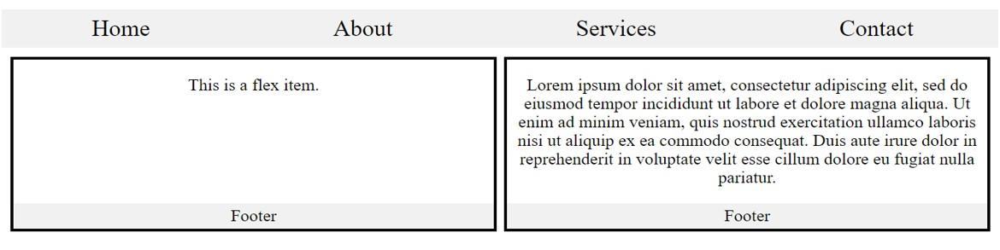

# Tasks by flex
# Task 1 as in :
  

# Solve Task1 as in:
 > 1. Task 1 in Mobile as: 
    
   2. Task 1 in Mobile after opening nav:
    
   3. Task 1 in Tablet as:
    
   4. Task 1 in Laptop:
    

# Task 2 as in :
  

# Solve Task2 as in:
 > 1. Task 2 in Mobile as: 
    
   2. Task 2 in Tablet as:
    
   3. Task 2 in Laptop:
    
   
# Task 3 as in :
  

# Solve Task3 as in:
 > 1. Task 3 in Mobile as: 
    
   2. Task 3 in Tablet as:
    
   3. Task 3 in Laptop:
    
  
# Task 4 Bootstrap Website:
  > rebuild website to make it responsive
   1. Bootstrap website in Laptop as :
     
   2. Bootstrap Website in Mobile as:
     
   3. Bootstrap Website after opening Nav:
     
 